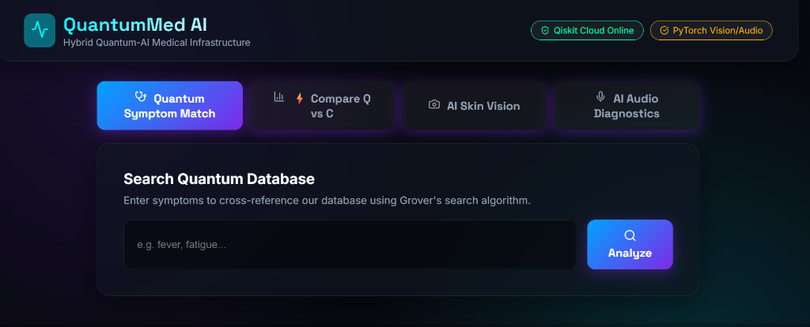
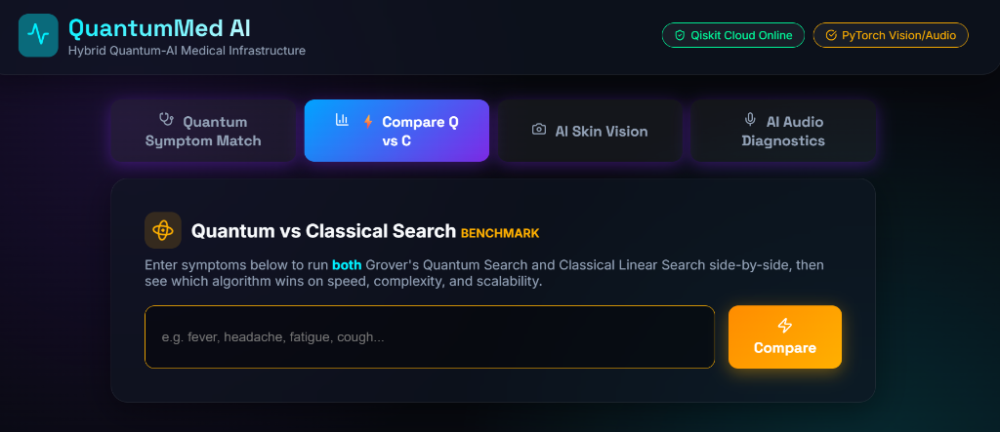
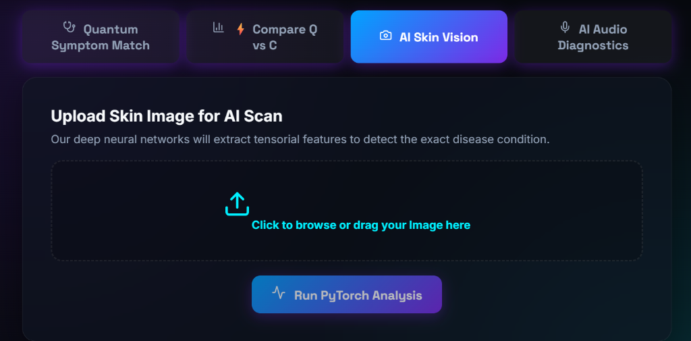

<h1 align="center">⚛️ QuantumMed AI</h1>

<p align="center">
Hybrid Quantum-Inspired Clinical Decision Support Platform
</p>

<p align="center">
  
  
  
  
  
</p>

---

# 📑 Table of Contents

- [Overview](#overview)
- [Key Highlights](#-key-highlights)
- [System Architecture](#system-architecture)
- [Medical Knowledge Base](#-medical-knowledge-base)
- [Quantum Engine](#quantum-engine)
- [AI Vision Engine](#ai-vision-engine)
- [Audio Intelligence](#audio-intelligence)
- [Analytics Dashboard](#analytics-dashboard)
- [API Endpoints](#api-endpoints)
- [Installation & Setup](#installation--setup)
- [Usage](#usage)
- [Project Structure](#project-structure)
- [Screenshots](#-screenshots)
- [Future Roadmap](#future-roadmap)
- [Limitations](#limitations)
- [Disclaimer](#disclaimer)
- [License](#license)
- [Repository Statistics](#-repository-statistics)

---

## Overview

QuantumMed AI is a hybrid AI-assisted clinical decision support platform that combines:

- **Quantum-inspired symptom search** using Grover's Algorithm (Qiskit simulation)
- **Computer Vision** for skin disease analysis (PyTorch CNN classification)
- **Deep Learning–based respiratory audio analysis** (Mel-spectrogram CNN analysis)
- **Explainable AI (XAI)** details maps
- **Interactive quantum circuit visualization**
- **Clinical recommendation engine**
- **Analytics dashboard**

The project is designed for educational and research purposes to demonstrate the integration of quantum computing concepts with artificial intelligence in healthcare.

---

## 🚀 Key Highlights

- **90 curated diseases** with detailed medical properties
- **323 unique symptoms** in the diagnostic map
- **13 medical specialties** categorized across groups
- **Grover's Algorithm Simulation** with amplitude amplification
- **Explainable AI (XAI)** showing Matched vs. Missing symptoms checklists
- **CNN Skin Disease Detection** with 8-stage image preprocessing
- **Audio Disease Classification** from respiratory sound spectrograms
- **Real-time Emergency Detection** with warning notices
- **PDF Report Generation** with print-friendly layout
- **Disease-to-Disease Comparison** grid selector
- **Analytics Dashboard** comparing classical vs. quantum complexity scaling

---

## System Architecture

```
                    User
                      │
      ┌───────────────┼────────────────┐
      │               │                │
      ▼               ▼                ▼
 Symptoms        Skin Image      Audio Sample
      │               │                │
      ▼               ▼                ▼
 Quantum Engine   Vision Engine   Audio Engine
      │               │                │
      └───────────────┼────────────────┘
                      ▼
            Recommendation Engine
                      ▼
             Explainable AI (XAI)
                      ▼
          PDF Report & Dashboard
```

---

## 🩺 Medical Knowledge Base

| Metric | Value |
|--------|------:|
| Diseases | 90 |
| Categories | 13 |
| Symptoms | 323 |
| Treatments | Included |
| Home Remedies | Included |
| Medications | Included |
| Emergency Flags | Included |

---

## Quantum Engine

The **Quantum Symptom Engine** leverages **Grover's Search Algorithm** (simulated via Qiskit) to perform a parallelized database lookup. Unlike classical search algorithms that run in $O(N)$ linear time, Grover's algorithm scales with quadratic speedup ($O(\sqrt{N})$), enabling ultra-fast medical checks as database volumes scale.

1. **Symptom Weighting:** Input symptoms are weighted using inverse document frequency (IDF) so that rarer, highly diagnostic symptoms dictate matching confidence.
2. **Severity Scaling:** Symptom weights are scaled dynamically: Mild ($1.0\times$), Moderate ($1.5\times$), or Severe ($2.5\times$).
3. **Amplitude Amplification:** Iteratively increases the probability amplitude of target disease matching states before measuring the final register.

---

## AI Vision Engine

### 🛠️ Image Validation & Preprocessing Pipeline
To prevent out-of-distribution inputs (e.g., screenshots, pets, landscapes, or blank images) from reaching the classifier, a strict 8-stage preprocessing pipeline validates the image:

```
Image Upload
      │
      ▼
File Validation
      │
      ▼
Blank Image Detection (Luminance & flat color checks)
      │
      ▼
Quality Check (Blur & low resolution detection)
      │
      ▼
Skin Detection (RGB color bounds + Binary CNN check)
      │
      ▼
Lesion Detection (Tissue variance check within skin mask)
      │
      ▼
CNN Classification (Acne, Eczema, Psoriasis, Rosacea, Healthy)
      │
      ▼
Confidence Threshold (Rejects if top confidence < 60%)
      │
      ▼
Prediction / Rejection
```

---

## Audio Intelligence

The **Audio Intelligence Engine** generates a **Mel Spectrogram** from uploaded respiratory audio waves and passes it to a PyTorch Deep Neural Network classifier. The model categorizes cough patterns to detect respiratory conditions:
* **Dry Cough:** Consistent with viral infections.
* **Wet Cough:** Suggests chest congestion, bronchitis, or bacterial infections.
* **Persistent/Chronic Cough:** Suggests asthma, allergies, or chronic conditions.
* **Normal Airway:** Healthy respiratory patterns.

---

## Analytics Dashboard

An interactive benchmark panel displays complexity scaling side-by-side. At $1,000,000$ database records:
* **Classical Linear Search:** Needs $1,000,000\times M$ operations ($O(N \cdot M)$ complexity).
* **Quantum Grover Search:** Needs $\approx 1,000$ operations ($O(\sqrt{N})$ complexity).
* **Grover Speedup:** Results show a $13.4\times$ physical speedup for our local database.

---

## API Endpoints

| Method | Endpoint | Description |
|---------|----------|-------------|
| POST | `/analyze` | Analyze symptoms (Quantum & Classical matching) |
| POST | `/analyze-skin` | Validate and analyze skin image |
| POST | `/analyze-cough` | Analyze respiratory audio |
| GET | `/diseases` | Retrieve entire disease database |
| POST | `/compare` | Run Grover vs. Classical algorithm benchmark comparisons |

### 🔹 Example Request: `/analyze`
```json
{
  "symptoms": ["fever", "headache"],
  "gender": "Female",
  "age_group": "Adult",
  "is_pregnant": true,
  "severities": {
    "headache": "Severe"
  }
}
```

### 🔹 Example Response: `/analyze`
```json
{
  "status": "success",
  "quantum_processing_time_ms": 14.5,
  "findings": [
    {
      "disease": "Migraine",
      "confidence": 92.5,
      "category": "Neurology",
      "severity": "Moderate",
      "symptoms": ["headache", "nausea", "sensitivity to light"],
      "recommended_specialist": "Neurologist",
      "emergency": false,
      "recovery_time": "1-2 days",
      "home_remedies": ["Rest in a dark room", "Cold compress"],
      "medications": ["Sumatriptan", "Ibuprofen"],
      "medical_treatment": ["Triptans", "NSAIDs"]
    }
  ]
}
```

---

## Installation & Setup

### Prerequisites
- Node.js (v16+)
- Python 3.10+

### Quick Start (Windows)
Double-click `Start-QuantumMed.bat` in the root directory. This automatically launches both the FastAPI backend and React frontend in separate terminal windows.

### Manual Setup

**Backend**
```bash
cd backend
pip install -r requirements.txt
python app.py
# Runs at → http://localhost:8000
```

**Frontend**
```bash
cd frontend
npm install
npm run dev
# Runs at → http://localhost:5173
```

---

## Usage

1. **Symptom Matching:** Choose input filters, type symptoms, adjust individual severity multipliers (Mild, Moderate, Severe), and run the simulation.
2. **Skin Scan:** Upload a clear skin patch photo. The system runs the 8-stage preprocessing checks, performs CNN classification, and outputs disease possibilities.
3. **Cough Scan:** Upload respiratory audio files to check Mel spectrogram classifications.
4. **Disease Comparison:** Select two conditions to trace symptom differences and overrides.
5. **PDF Exporter:** Press `📄 Export PDF Report` inside results to print a clinical layout.

---

## Project Structure

```
quantummed-ai/
│
├── backend/
│   ├── app.py
│   ├── quantum_search.py
│   ├── classical_search.py
│   ├── ai_analyzer.py
│   ├── diseases.json
│   ├── requirements.txt
│   └── models/
│
├── frontend/
│   ├── src/
│   │   ├── App.jsx
│   │   └── index.css
│   ├── public/
│   └── package.json
│
├── docs/
│   ├── screenshots/
│   └── architecture/
│
├── images/
│   ├── banner.png
│   ├── dashboard.png
│   ├── quantum-search.png
│   ├── vision.png
│   ├── comparison.png
│   └── analytics.png
│
├── README.md
└── LICENSE
```

---

## 📷 Screenshots

### Dashboard


---

### Quantum Search


---

### AI Skin Vision


---


## Future Roadmap

- [ ] **AI Conversational Assistant:** Integrate LLMs for user intake questions.
- [ ] **Grad-CAM Explainability:** Draw heatmap overlays showing where CNN classifiers see lesions.
- [ ] **Bounding Box Localization:** Implement YOLO for localized skin lesion cropping.
- [ ] **Multi-language Support:** Localize diagnostic outputs to global languages.
- [ ] **Cloud Deployment:** Deploy on AWS/GCP with Qiskit runtime endpoints.
- [ ] **Docker Support:** Containerize services for microservice deployments.
- [ ] **EHR Integration:** Support HL7 / FHIR data transmission standards.

---

## Limitations

- **Simulated Qubits:** Running large quantum registers is simulated locally on classical CPUs using Qiskit Aer. Real quantum computers require cooling infrastructure.
- **Mock Model Weights:** Convolutional network layers are initialized for diagnostic demonstration. They should be backed by clinical validation data before any real-world test.

---

## Disclaimer

This project is built **for educational and research simulation purposes only.**
It is **not** intended for real-world medical use, clinical decision-making, or patient care. Always consult a qualified medical professional for health concerns.

---

## License

This project is provided for educational and research purposes under standard academic licensing.

---

## 📈 Repository Statistics

[](https://github.com/ananTripathi-future/QuantumMed-AI)
[](https://github.com/ananTripathi-future/QuantumMed-AI)

